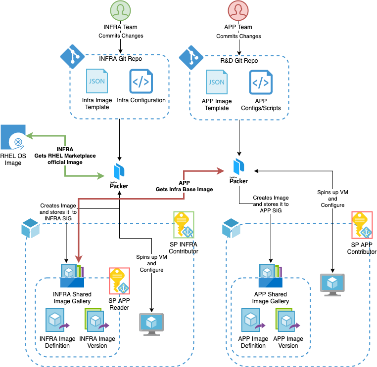

# Azure Shared Image Gallery for Organizations with Distributed IT Departments that Shares Common Default Image

This architecture approach covers the case when an organization has several IT departments where one department(e.g. INFRA) is responsible
for the base image(patches, hardening, tuning, and etc.), and other departments are restricted to use the base image developing their own applications.

The concept is very similar to the containers approach where the basic image is used and any new modification is a layer.



# INFRA
In this scenario, the INFRA department is responsible for the base image. It creates and stores in Azure Shared Image Gallery a company-wide default image with all hardening, tuning, and etc. that is used by other departments.

INFRA department owns this default image and the APP department restricted to the read rights. So no one else can modify/delete the default image.

### 1. Create INFRA RG
```bash
infra_group_id=$(az group create -l westeurope -n INFRA --query "id" -o tsv)
```

### 2. Create INFRA SP and save the output credentials
Packer authenticates with Azure using a service principal(SP). We'll need these credentials later. Please, save the output.
```bash
az ad sp create-for-rbac -n "INFRA" \
--role contributor \
--scopes ${infra_group_id} \
--query "{ client_id: appId, client_secret: password }"
```

### 3. Get Subscription ID
We'll need this id later. Please, save the output.
```bash
az account show --query "{ subscription_id: id }"
```

### 3. Create INFRA Shared Image Gallery
```bash
infra_sig_id=$(az sig create --resource-group INFRA --gallery-name infraGallery --query "id" -o tsv)
```

### 5. Create image definition
```bash
az sig image-definition create --resource-group "INFRA" --gallery-name "infraGallery" --gallery-image-definition "Rhel-Infra" --publisher "Infra" --offer "RHEL" --sku "7.3" --os-type "linux"
```

### 6. Create a Packer template for infra
See ```rhel-infra.json``` for reference

### 7. Create ```infra-env.sh``` with proper env variables
See ```infra-env.sh``` for reference

```bash 
chmod +x infra-env.sh
```

### 8. Source env variables and run packer
```bash
. ./infra-env.sh && packer build rhel-infra.json
```
Under the hood, Packer creates a set of temporary assets in the INFRA RG (this can be changed to the usage of the pre-defined RG), creates a VM based on the RHEL image, applies configuration change.

# APP
The APP department develops an application. Company policies prohibit usage of any other images and restrict usage to the approved INFRA default image only.

### 1. Create APP RG
```bash
app_group_id=$(az group create -l westeurope -n APP --query "id" -o tsv)
```

### 2. Create APP SP and save the output credentials
Packer authenticates in Azure using a service principal(SP). We'll need these credentials later. Please, save the output.
```bash
az ad sp create-for-rbac -n "APP" \
--role contributor \
--scopes ${app_group_id} \
--query "{ client_id: appId, client_secret: password }"
```
### 3. Assign APP SP 'Reader' role for Infra Shared Image Gallery 
```bash
az ad sp create-for-rbac -n "APP" \
--role reader --scopes ${infra_sig_id}
```

### 3. Get Subscription ID
We'll need this id later. Please, save the output.
```bash
az account show --query "{ subscription_id: id }"
```

### 3. Create APP Shared Image Gallery
```bash
az sig create --resource-group APP --gallery-name APPGallery
```

### 5. Create image definition
```bash
az sig image-definition create --resource-group "APP" --gallery-name "APPGallery" --gallery-image-definition "Rhel-APP" --publisher "APP" --offer "RHEL" --sku "7.3" --os-type "linux"
```

### 6. Create a Packer template for APP
See ```rhel-app.json``` for reference

### 7. Create ```app-env.sh``` with proper env variables
See ```app-env.sh``` for reference
```bash
chmod +x 'app-env.sh'
```

### 8. Source env variables and run packer
```bash
. ./app-env.sh && packer build rhel-app.json
```
Under the hood, Packer creates a set of temporary assets in APP RG (this can be changed to the usage of the pre-defined RG), creates a VM based on the default INFRA base image, applies configuration change.

# Verify
Create 2 VMs using the default INFRA image and the APP image correspondently. Open your web browser and reach the web page using public IP addresses of the machines you've created. Observe the results. 

# Useful links
* https://www.packer.io/docs/builders/azure/arm
* https://github.com/hashicorp/packer/blob/master/examples/azure/
* https://www.hashicorp.com/resources/building-a-golden-image-pipeline-with-hashicorp-packer-and-azure-devops/
* https://docs.microsoft.com/en-us/azure/virtual-machines/linux/shared-image-galleries
